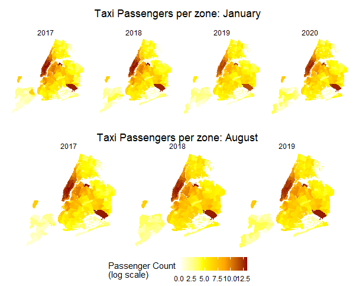
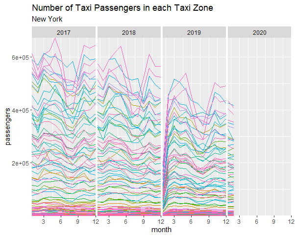

GitHub: 'https://github.com/celinao/yellowTaxi'

For our project, we used a data set with information from New York City taxi cabs from January 2017 through February 2020. We decided on this time frame because it was pre-COVID, and we did not want the nuisance factor of COVID to impact our data analysis. We gathered our data from the Taxi and Limousine commission website. Our goal was to see if there was a relationship between the fare amount and the time and place the ride started. In other words, our goal was to see if certain times and places in New York City led to variable  fare rates for taxis. Additionally, we also wanted to get a visual on the distribution of the passengers throughout the taxi zones in New York City. We used CHTC to get and process our data through an R script as well as run a multiple linear regression of pickup time and location on fare amount. In the end, we were able to create a predictive model from the data to predict taxi fare rate based on pickup time and location, while also creating visualizations for the distribution of passengers throughout New York City.  

We created a heatmap of where the most passengers were picked up in the city to see if there were any areas that had a higher concentration of travelers (and would thus be more profitable). We saw that the island of Manhattan and the airports (JFK & LGA) had the highest concentration of passengers by far. The concentration of those three areas were so high that we had to change to a log scale for there to be any differentiation between the other taxi zones. Additionally, while we did graph separate the graphs by year and month we saw no significant difference in passenger location between the different months and years.  

   

We created a time series plot of the number of taxi passengers in each zone. Our plot shows that some zones have higher passenger counts on average, and that the overall number of passengers across taxi zones tends to decrease over time. It also appears that the number of passengers is lower on average during the summer months (June - August), which could indicate that fewer people want to take taxis in warmer weather.  

We ran 38 jobs on datasets ranging from 600 MB to 3 GB. However, since we were only selecting a subset of these datasets, we were able to use 150 MB of disk on average. A typical job also took on average 3 minutes and used 2 MB of memory. We had to do some data cleaning to get the pickup times from the format “%Y-%m-%d %H:%M:%S” to extract just the hour value. This was the only piece of major data cleaning that we needed to do to run the regression.   

The statistical method we went with was multiple linear regression. Our response variable was fare amount while our explanatory variables were pickup time and location. We thought there was a possibility that there could be an interaction between pickup time and location, so we decided to include an interaction term between pickup time and location. The result of our multiple regression led to our formula for predicted fare rate being $$\hat{Fare\_Amt} = 14.281 + .0774Pickup\_time -.0073Location\_ID - .0005 (Pickup\_time * Location\_ID)$$. 

Since the data was from a short span of time, only three years, we decided not to account for inflation. However, inflation could be negatively impacting our regression. We also did not include confidence intervals for the mean, as it was suggested. This might have been useful since our regression coefficients were quite small. Another weakness of our model was that we had to average the regression coefficients across subsets. Since repeated measures of regression coefficients using ordinary least squares regression follow a normal distribution, we are confident in estimating using the mean of all the coefficients; however, this method may not yield optimal results.   

In conclusion, we were successful in finding a regression model to predict fare amount as well as in visualizing the distribution of passengers using taxis in New York city from January 2017 through February 2020. Future work could repeat our process with the data from March 2022 onwards, and try to estimate the impact of COVID-19 on yellow taxi fares and passenger counts. One could also try to get population data for New York City and compare this to the distribution of passengers throughout taxi zones. Since we found that passenger counts have been decreasing, it might be interesting to compare this data to that of For-Hire Vehicles (such as Uber and Lyft), which could possibly be taking away the customer base of the yellow taxis.  

